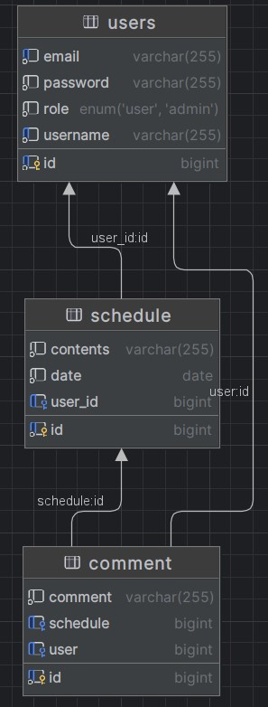
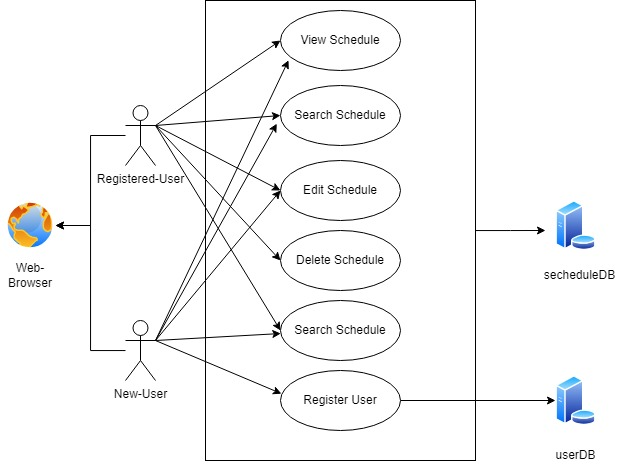

변경 된것,

1. JWT 쿠키 ->  그냥 해더에 추가      !!! 그래서 현제 프엔은 제대로 작동 하지 않음!!!!
2. Schedule(Todo) 서비스 UserDetailsImpl 사용 X , jwt  안에 있는 유저 정보로 작동.     !!! 그래서 현제 프엔은 제대로 작동 하지 않음!!!!
3. Projection 추가 -> 필요 없는 필드 안가져오기
4. @query 추가
5. ID  @GeneratedValue(strategy = GenerationType.SEQUENCE)
6. repo 에 @query 추가.
7. Time Stamp 추가.
8. ResponseDto 추가

/-------------------------------------------------------------------------------------------------------------------------------------------------------

API 명세서 :

스케줄 API

| 기능 | Method | URL | request  | response |
|----|--------|-----|----------------------------------------|----------|
| 생성 | POST   |/api/schedule| ScheduleRequestDto,UserDetailsImpl     |ScheduleResponseDto|
| 조회 | GET    |/api/schedule| UserDetailsImpl                        |List<ScheduleResponseDto>|
| 수정 | PUT    |/api/schedule/{id}| long(id),ScheduleRequestDto,UserDetailsImpl |Long|
| 삭제 | DELETE |/api/schedule/{id}| long(id),UserDetailsImpl               |Long|
| ID 로 조회 | GET    |/api/schedule/search/{id}| long(id),UserDetailsImpl               |ScheduleResponseDto|
| 날자 로 조회 | GET    |/api/schedule/search /date/{date}| LocalDate,UserDetailsImpl |  List<ScheduleResponseDto>        |

유저/로그인 API

| 기능           | Method | URL  | request  |  response |
|--------------|---|---|--------------------------------------|-|
| login.html 이동 |GET|/api/user/login-page| NULL |String|
| signup.html 이동 |GET|/api/user/signup| NULL  |String|
| 유저 생성 |POST|/api/user/signup| SignupRequestDto |String |
| 로그인 |POST|/api/user/login | LoginRequestDto, HttpServletResponse |String |
| 로그아웃 컨펌 |GET|/api/logout |HttpServletRequest,HttpServletResponse |String|

홈 API

| 기능              | Method | URL                    | request |  response |
|-----------------|--------|------------------------|--------|---|
| index.html 이동   | GET    | /                      | Model  | String  |
| search.html 이동  | GET    | /api/user/search-page  | Model  |  String |
| comment.html 이동 | get    | /api/user/comment-page | Model  |  String       |

댓글 API (프런트 는 구현 하지 못했습니다.)
(생각한 설계는)
(스케줄 에 댓글 달기 페이지 버튼 -> comment.html 에서 해당 스케줄 아이디 전달 "/api/comment?ID=1"-> 그 아이디로 스케줄 + 댓글들 가져오기.)

| 기능            | Method | URL                  | request                           | response                 |
|---------------|--------|----------------------|-----------------------------------|--------------------------|
| 해당 스캐줄의 댓글 생성 | POST   | /api/comment         | CommentRequestDto,LoginRequestDto| CommentResponseDto       |
| 해당 스캐줄의 댓들 조회 | GET    | /api/comment?ID={id} | Long Id (스케줄 ID) | List<CommentResponseDto> |
| 해당 댓들 변경  | PUT    | /api/comment/{id}    | CommentRequestDto,LoginRequestDto | Long   |
| 해당 댓들 삭제  | DELETE | /api/comment/{id}    | Long Id (댓글 ID),LoginRequestDto   |   Long  |

ERD 다이어 그램

USECASE 다이어 그램

